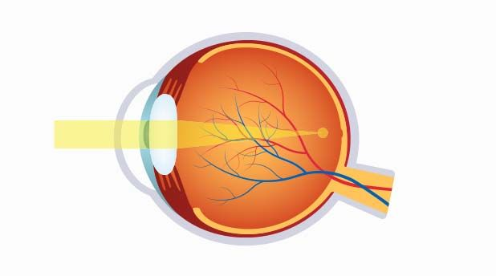
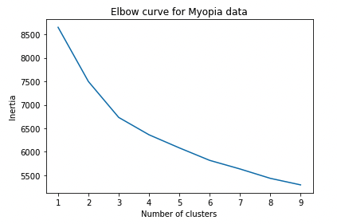
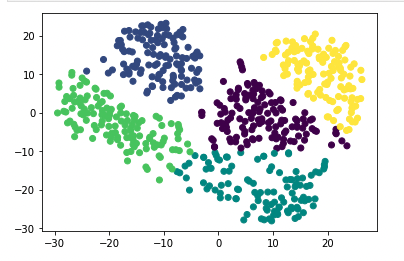

# Myopia-Clusters

Description:
A medical research company believes that there might be distinct groups of patients that would be better to analyze separately in a data set being used to predict Myopia, or nearsightedness. Here I will explore this possibility by using unsupervised learning.
Starting with raw data, I will first prepare it to fit the machine learning models. Several clustering algorithms will be used to explore whether the patients can be placed into distinct groups. Following the models, I created a visualization to share my findings.

image source: https://eyehealthconsultants.com/eye-care/myopia

Process:
Part 1: Prepare the Data
Part 2: Apply Dimensionality Reduction
Part 3: Perform a Cluster Analysis with K-means
Part 4: Make a Recommendation

